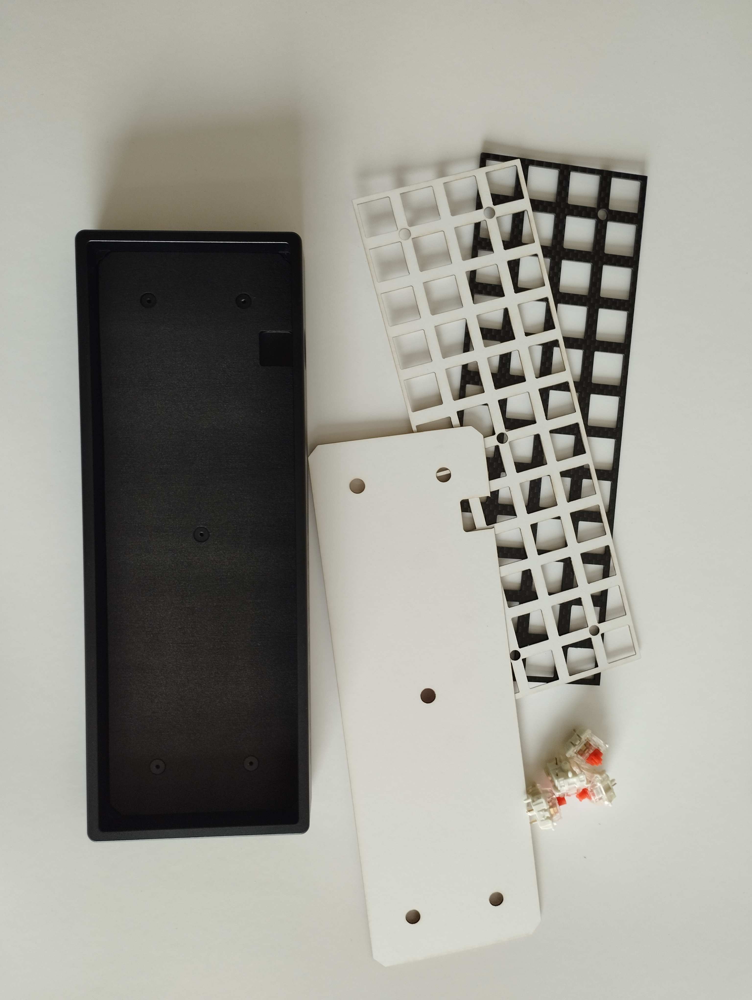

<h4 align="center">
    BM40 FOAM MOD (EVA) LASER CUT FILES
</h4>

    

<h3>Description</h3>

I created this project to have the best Foam Mod for my KPrepublic BM40V2 keyboard, I developed the project using Adobe Illustrator, in each folder there is the <code>Project</code> file containing all the editable layers in the <code>Laser Cut Project</code> file is the file already finished for cutting, you You must use the <code>.dxf</code> file on a CNC Laser, for my use I used a black EVA.

Video showing the process <a href="https://youtu.be/UsEVg7EXpRI">link</a>.

Feel free to modify and distribute, giving credit to me.

To edit the project, if necessary, you will need Adobe Illustrator CC 2020+.

